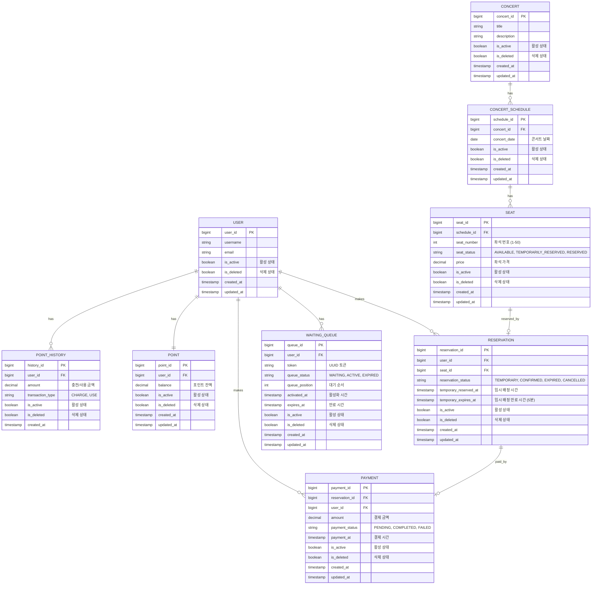

# 🎤 콘서트 예약 서비스

## ERD (Entity Relationship Diagram)

## 엔티티 설명

### USER (사용자)
- 시스템을 이용하는 사용자 정보
- 포인트, 예약, 결제, 대기열과 연관

### POINT (포인트)
- 사용자별 현재 포인트 잔액
- 결제에 사용됨

### POINT_HISTORY (포인트 내역)
- 포인트 충전/사용 이력 추적
- transaction_type: CHARGE(충전), USE(사용)

### CONCERT (콘서트)
- 콘서트 기본 정보

### CONCERT_SCHEDULE (콘서트 일정)
- 콘서트별 예약 가능한 날짜 정보
- 하나의 콘서트는 여러 일정을 가질 수 있음

### SEAT (좌석)
- 콘서트 일정별 좌석 정보 (1-50번)
- 좌석 상태:
  - AVAILABLE: 예약 가능
  - TEMPORARILY_RESERVED: 임시 배정 (5분간)
  - RESERVED: 예약 완료

### RESERVATION (예약)
- 사용자의 좌석 예약 정보
- 예약 상태:
  - TEMPORARY: 임시 배정 (결제 대기)
  - CONFIRMED: 결제 완료로 확정
  - EXPIRED: 5분 내 미결제로 만료
  - CANCELLED: 취소됨
- temporary_expires_at: 임시 배정 후 5분 후 자동 만료

### PAYMENT (결제)
- 예약에 대한 결제 정보
- 결제 완료 시 좌석 소유권 배정 및 대기열 토큰 만료

### WAITING_QUEUE (대기열)
- 서비스 이용을 위한 대기열 관리
- 토큰 상태:
  - WAITING: 대기 중
  - ACTIVE: 활성화 (서비스 이용 가능)
  - EXPIRED: 만료됨
- queue_position: 대기 순서 관리

## 주요 비즈니스 로직

1. **좌석 예약 프로세스**
   - 사용자가 ACTIVE 대기열 토큰 필요
   - 좌석 선택 → SEAT 상태를 TEMPORARILY_RESERVED로 변경
   - RESERVATION 생성 (TEMPORARY 상태, 5분 만료 시간 설정)
   - 5분 내 결제 미완료 시 자동 만료 → 좌석 상태 AVAILABLE로 복원

2. **결제 프로세스**
   - 사용자 포인트 잔액 확인
   - PAYMENT 생성 및 포인트 차감
   - 결제 완료 시:
     - RESERVATION 상태 → CONFIRMED
     - SEAT 상태 → RESERVED
     - WAITING_QUEUE 토큰 → EXPIRED

3. **동시성 제어**
   - 좌석 예약 시 비관적 락(Pessimistic Lock) 또는 낙관적 락(Optimistic Lock) 사용
   - 포인트 차감 시 트랜잭션 격리 수준 관리

4. **대기열 관리**
   - 특정 시간 동안 N명에게만 ACTIVE 권한 부여
   - 활성화된 최대 유저 수 N으로 유지
   - 순서대로 정확한 대기열 제공